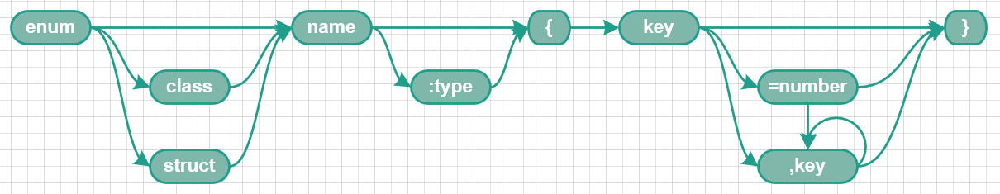
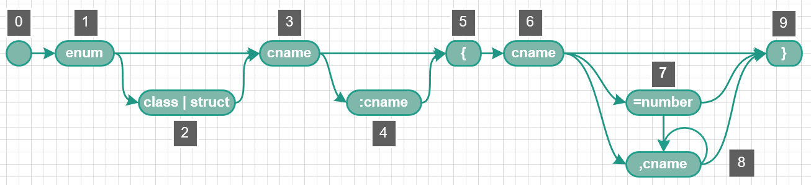
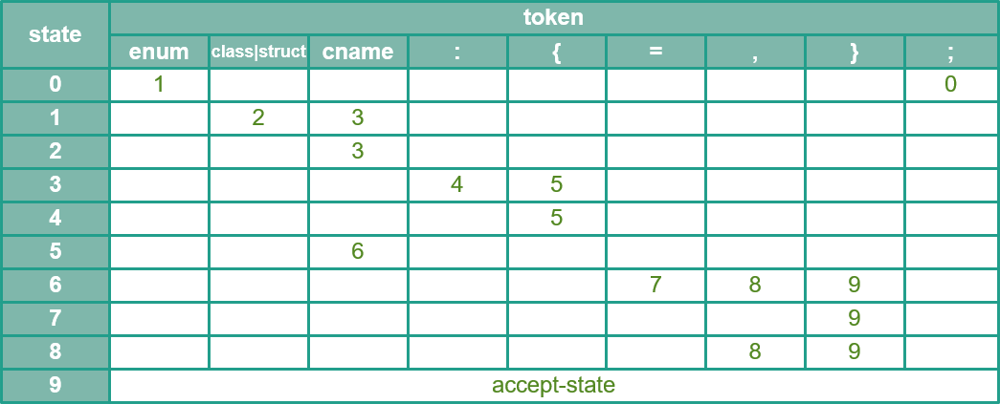
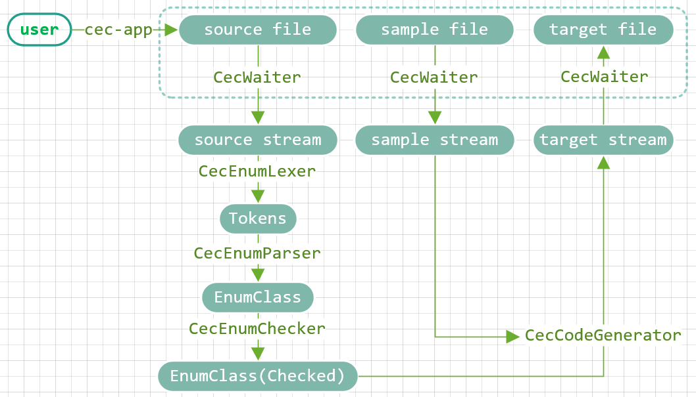

# Some develop notes.

## C++ Standard Enumeration declaration.
Come from https://en.cppreference.com/w/cpp/language/enum
```
enum name(optional) { enumerator = constexpr , enumerator = constexpr , ... }
enum name(optional) : type { enumerator = constexpr , enumerator = constexpr , ... }	
enum struct|class name { enumerator = constexpr , enumerator = constexpr , ... }
enum struct|class name : type { enumerator = constexpr , enumerator = constexpr , ... }	
```

## Simplified Enumeration declaration.
It is a subset enum declaration which is designed and used by **cec**.
  
```
"enum" ("class"|"struct")? name(":" type)? "{" key("=" number)? ("," key)* "}"
```

## CecEnumLexer. 
CecEnumLexer implementation used re2c(https://github.com/skvadrik/re2c). 
```
Dec             = ("+"|"-")?[0-9]{1,31};
Hex             = ("+"|"-")?("0x"|"0X")[0-9A-Fa-f]{1,31}; 
TokenNumber     = Dec | Hex;
TokenEnum       = "enum";
TokenClass      = "class" | "struct";
TokenCName      = [a-zA-Z_][a-zA-Z0-9_]{0,30};
TokenColon      = ":";
TokenLB         = "{";
TokenEq         = "=";
TokenComma      = ",";
TokenRB         = "}";
TokenSemicolon  = ";";
```


## State machine for CecEnumParser.
  

## Goto table for CecEnumParser.


## Data stream workflow.


[Go back to parent.](../readme.md#get-start-here)  
